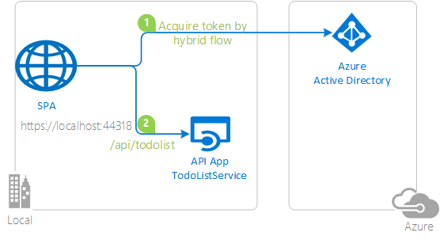

# Tutorial: Enable your Blazor Server app to sign-in users and call APIs with the Microsoft identity platform

The [Microsoft identity platform](https://docs.microsoft.com/azure/active-directory/develop/v2-overview), along with [Azure Active Directory](https://docs.microsoft.com/azure/active-directory/fundamentals/active-directory-whatis) (Azure AD) and [Azure Azure Active Directory B2C](https://docs.microsoft.com/azure/active-directory-b2c/overview) (Azure AD B2C) are central to the **Azure** cloud ecosystem. This tutorial aims to take you through the fundamentals of enabling modern authentication for an ASP.NET Core Blazor Server, using the [Microsoft Authentication Library](https://docs.microsoft.com/azure/active-directory/develop/msal-overview) and [Microsoft.Identity.Web](https://aka.ms/microsoft-identity-web).

> :warning: This is a *work in progress*. Come back frequently to discover more samples.

## Prerequisites

- Either [Visual Studio](https://visualstudio.microsoft.com/downloads/) or [Visual Studio Code](https://code.visualstudio.com/download)

Please refer to each sample's README for sample-specific prerequisites.

## Recommendations

- [jwt.ms](https://jwt.ms) for inspecting your tokens.
- [Fiddler](https://www.telerik.com/fiddler) for monitoring your network activity and troubleshooting.
- Follow the [Azure AD Blog](https://techcommunity.microsoft.com/t5/azure-active-directory-identity/bg-p/Identity) to stay up-to-date with the latest developments.

## Setup

### Clone or download this repository

From your shell or command line:

```console
git clone https://github.com/Azure-Samples/ms-identity-blazor-server.git
```

or download and extract the repository .zip file.

Please refer to each sample's README for sample-specific recommendations.

## Contents

- For **Azure AD**, start the tutorial from [here](./WebApp-OIDC/MyOrg/README.md)
- For **Azure AD B2C**, start the tutorial from [here](./WebApp-OIDC/B2C/README.md)

We recommend following the chapters in successive order. However, the code samples are self-contained, so feel free to pick samples by topics that you may need at the moment.

### Chapter 1: Adding Authentication with Azure AD in your web application

|               |               |
|---------------|---------------|
|  | [**Sign-in with Azure AD**](./WebApp-OIDC/MyOrg) </br> Sign-in your users with the Microsoft Identity platform and learn to work with ID tokens. |
|  | [**Sign-in with Azure AD B2C**](./WebApp-OIDC/B2C) </br> Sign-in your customers with Azure AD B2C. Learn to integrate with external social identity providers. Learn how to use user-flows and custom policies. |

### Chapter 2: Sign-in a user and get an Access Token for Microsoft Graph

|                |               |
|----------------|---------------|
|  | [**Acquire an Access Token from Azure AD and call Microsoft Graph**](./WebApp-graph-user/Call-MSGraph) </br> Here we build on the concepts we built to authenticate users to further acquire an Access Token for Microsoft Graph and then call the Microsoft Graph API. |

### Chapter 3: Protect an API and call the API from your client app

|                |               |
|----------------|---------------|
|  | [**Protect and call a web API on Azure AD**](./WebApp-your-API/MyOrg) </br> Protect your web API with the Azure AD. Use a client application to sign-in a user, acquire an Access Token for your web API and call your protected Web API. |
|  | [**Protect and call a web API on Azure AD B2C**](./WebApp-your-API/B2C) </br> Protect your web API with the Azure AD B2C. Sign-in a user using a client application, acquire an Access Token for your web API and call your protected Web API. |

### Chapter 4: Deploy your solutions to Azure

|                 |               |
|-----------------|---------------|
|  | [**Deploy to Azure App Services**](./Deploy-to-Azure) </br> Finally, we prepare your app for deployment to various Azure services. Learn how to package and upload files, Configure authentication parameters and use the various Azure services for managing your operations. |

### Chapter 5: Connect to Azure SQL Database using Azure AD authentication

|                 |               |
|-----------------|---------------|
|  | [**Connect to Azure SQL Database**](./WebApp-Connect-To-Azure-Sql-Database) </br> Signing into AAD and use the same Access Token to login into Azure SQL Database. |

## We'd love your feedback!

Were we successful in addressing your learning objective? [Do consider taking a moment to share your experience with us.](https://forms.office.com/Pages/ResponsePage.aspx?id=v4j5cvGGr0GRqy180BHbR73pcsbpbxNJuZCMKN0lURpUMFJCNURBV1g2UTlKQjZTOTFGS09ZNjVMNSQlQCN0PWcu)

## More information

Learn more about the **Microsoft identity platform**:

- [Microsoft identity platform](https://docs.microsoft.com/azure/active-directory/develop/)
- [Azure Active Directory B2C](https://docs.microsoft.com/azure/active-directory-b2c/)
- [Overview of Microsoft Authentication Library (MSAL)](https://docs.microsoft.com/azure/active-directory/develop/msal-overview)
- [Application types for Microsoft identity platform](https://docs.microsoft.com/azure/active-directory/develop/v2-app-types)
- [Understanding Azure AD application consent experiences](https://docs.microsoft.com/azure/active-directory/develop/application-consent-experience)
- [Understand user and admin consent](https://docs.microsoft.com/azure/active-directory/develop/howto-convert-app-to-be-multi-tenant#understand-user-and-admin-consent)
- [Application and service principal objects in Azure Active Directory](https://docs.microsoft.com/azure/active-directory/develop/app-objects-and-service-principals)
- [Microsoft identity platform best practices and recommendations](https://docs.microsoft.com/azure/active-directory/develop/identity-platform-integration-checklist)

See more code samples:

- [MSAL code samples](https://docs.microsoft.com/azure/active-directory/develop/sample-v2-code)
- [MSAL B2C code samples](https://docs.microsoft.com/azure/active-directory-b2c/code-samples)

## Community Help and Support

Use [Stack Overflow](http://stackoverflow.com/questions/tagged/msal) to get support from the community.
Ask your questions on Stack Overflow first and browse existing issues to see if someone has asked your question before.
Make sure that your questions or comments are tagged with [`azure-active-directory` `azure-ad-b2c` `ms-identity` `msal`].

If you find a bug in the sample, raise the issue on [GitHub Issues](../../issues).

To provide feedback on or suggest features for Azure Active Directory, visit [User Voice page](https://feedback.azure.com/forums/169401-azure-active-directory).

## Contributing

If you'd like to contribute to this sample, see [CONTRIBUTING.MD](../../CONTRIBUTING.md).

This project has adopted the [Microsoft Open Source Code of Conduct](https://opensource.microsoft.com/codeofconduct/). For more information, see the [Code of Conduct FAQ](https://opensource.microsoft.com/codeofconduct/faq/) or contact [opencode@microsoft.com](mailto:opencode@microsoft.com) with any additional questions or comments.

## Code of Conduct

This project has adopted the [Microsoft Open Source Code of Conduct](https://opensource.microsoft.com/codeofconduct/).
For more information see the [Code of Conduct FAQ](https://opensource.microsoft.com/codeofconduct/faq/) or
contact [opencode@microsoft.com](mailto:opencode@microsoft.com) with any additional questions or comments.
