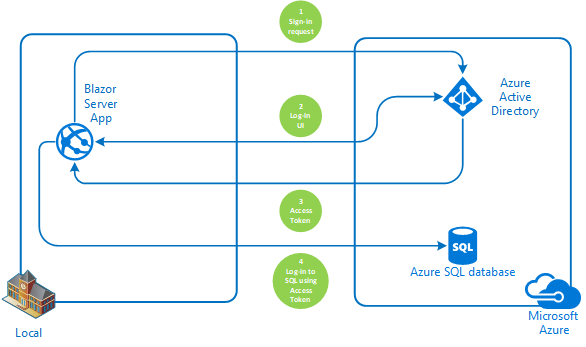

# How to use an authenticated user's credentials for log-in to an Azure SQL Database from Blazor Web Server App

[](https://identitydivision.visualstudio.com/IDDP/_build/latest?definitionId=819)

Table Of Contents

* [Scenario](#Scenario)
* [Prerequisites](#Prerequisites)
* [Setup the sample](#Setup-the-sample)
* [Troubleshooting](#Troubleshooting)
* [Using the sample](#Using-the-sample)
* [About the code](#About-the-code)
* [How to deploy this sample to Azure](#How-to-deploy-this-sample-to-Azure)
* [Next Steps](#Next-Steps)
* [Contributing](#Contributing)
* [Learn More](#Learn-More)

## Scenario

This sample demonstrates a Blazor Server App querying an Azure SQL Database with the same authenticated user logged-in into the database. In other words, SQL Database will act exactly for user logged-in instead of active with administrator access rights.




## Prerequisites

* Either [Visual Studio](https://visualstudio.microsoft.com/downloads/) or [Visual Studio Code](https://code.visualstudio.com/download) and [.NET Core SDK](https://www.microsoft.com/net/learn/get-started)
* Azure subscription and Tenant with at least one user created in it
* Azure [SQL Database](https://docs.microsoft.com/azure/azure-sql/database/single-database-create-quickstart)

## Setup the sample

### Step 1: Clone or download this repository

From your shell or command line:

```console
    git clone https://github.com/Azure-Samples/ms-identity-blazor-server.git
```

or download and extract the repository .zip file.

>:warning: To avoid path length limitations on Windows, we recommend cloning into a directory near the root of your drive.

### Step 2: Setup Azure SQL Database and grant user permissions for managed identity

1. Create an [Azure SQL Database](https://docs.microsoft.com/azure/azure-sql/database/single-database-create-quickstart).
   * The Sql database Server should have either `Use only Azure Active Directory (Azure AD) authentication` or `Use both SQL and Azure AD authentication` set up as Authentication method.
2. Add one or more of this Azure AD tenant's user as or "Azure Active Directory admin". You would use this user to execute the next set of Sql statements.
3. Install [SQL Server Management Studio](https://docs.microsoft.com/sql/ssms/download-sql-server-management-studio-ssms) and connect to your newly created Azure SQL database using the account you set as "Azure Active Directory admin".
4. In your newly created Database, run the following SQL statements to create and populate a database table to be used in this sample.

   ```sql
   CREATE TABLE [dbo].[Summary](
   [Summary] [nvarchar](50) NOT NULL) 
   ```

   ```sql
   Insert into [dbo].Summary values ('Freezing'),('Bracing'),('Chilly'),('Cool'),('Mild'),('Warm'),('Balmy'),('Hot'),('Sweltering'),('Scorching')
   ```

   ```sql
   CREATE FUNCTION [dbo].[UsernamePrintFn]()
   RETURNS nvarchar(500)
   AS
   BEGIN
       declare @host nvarchar(100), @user nvarchar(100);
       SELECT @host = HOST_NAME() , @user = SUSER_NAME()
       declare @result nvarchar(500) = cast(@user + ' at ' + @host as nvarchar(500))
       -- Return the result of the function
       return @result
   END   
   ```

   ```sql
   /**
   You can use the following command to ensure that the table and function were correctly created and work as expected
   **/
   SELECT * FROM [dbo].Summary
   GO

   SELECT [dbo].[UsernamePrintFn] ()
   GO
   ```

   ```Sql
      /**
   Create a user in database from users in your Tenant and grant them EXECUTE permission by running next set of commands.
   You can add more directory users to this database by running these statements repeatedly.
   **/
   DECLARE @AADDBUser nvarchar(128)
   SET @AADDBUser = '<myusername>@<mytenant>.onmicrosoft.com'

   DECLARE @sql as varchar(max)
   SET @SQL = 'CREATE USER [' + @AADDBUser + '] FROM EXTERNAL PROVIDER;
   EXECUTE sp_addrolemember db_datareader, ''' + @AADDBUser + ''';
   grant execute to ''' + @AADDBUser +''''

   EXEC @SQL
   ```

5. Update connection string inside appsettings.json with server and database names
6. You might need to [update the database Firewall](https://docs.microsoft.com/azure/azure-sql/database/firewall-configure?view=azuresql#from-the-database-overview-page) with your IP address.

### Step 3: Application Registration

There is one project in this sample. To register it, you can:

Follow the [manual steps](#Manual-steps)

**OR**

#### Run automation scripts

* use PowerShell scripts that:
  * **automatically** creates the Azure AD applications and related objects (passwords, permissions, dependencies) for you.
  * modify the projects' configuration files.

  <details>
   <summary>Expand this section if you want to use this automation:</summary>

    > **WARNING**: If you have never used **Azure AD Powershell** before, we recommend you go through the [App Creation Scripts guide](./AppCreationScripts/AppCreationScripts.md) once to ensure that your environment is prepared correctly for this step.
  
    1. On Windows, run PowerShell as **Administrator** and navigate to the root of the cloned directory
    1. In PowerShell run:

       ```PowerShell
       Set-ExecutionPolicy -ExecutionPolicy RemoteSigned -Scope Process -Force
       ```

    1. Run the script to create your Azure AD application and configure the code of the sample application accordingly.
    1. For interactive process - in PowerShell run:

       ```PowerShell
       cd .\AppCreationScripts\
       .\Configure.ps1 -TenantId "[Optional] - your tenant id" -Environment "[Optional] - Azure environment, defaults to 'Global'"
       ```

    1. In case the previous script fails with error about duplicate App Registration, you might want to run the next cleanup script prior to re-running Configure.ps1

       ```powershell
       cd .\AppCreationScripts\
       .\Cleanup.ps1
       ```

       > Other ways of running the scripts are described in [App Creation Scripts guide](./AppCreationScripts/AppCreationScripts.md)
       > The scripts also provide a guide to automated application registration, configuration and removal which can help in your CI/CD scenarios.

  </details>

#### Manual Steps

 > Note: skip this part if you've just used Automation steps

Follow the steps below for manually register and configure your apps

<details>
   <summary>Expand this section if you want to use the steps:</summary>

   1. Sign in to the [Azure portal](https://portal.azure.com).
   2. If your account is present in more than one Azure AD tenant, select your profile at the top right corner in the menu on top of the page, and then **switch directory** to change your portal session to the desired Azure AD tenant.

##### Register the client app (ClientApp-blazor-azuresql)

   1. Navigate to the [Azure portal](https://portal.azure.com) and select the **Azure AD** service.
   1. Select the **App Registrations** blade on the left, then select **New registration**.
   1. In the **Register an application page** that appears, enter your application's registration information:
      * In the **Name** section, enter a meaningful application name that will be displayed to users of the app, for example `ClientApp-blazor-azuresql`.
   1. Under **Supported account types**, select **Accounts in this organizational directory only**
   1. Click **Register** to create the application.
   1. In the app's registration screen, find and note the **Application (client) ID**. You use this value in your app's configuration file(s) later in your code.
   1. In the app's registration screen, select **Authentication** in the menu.
      * If you don't have a platform added, select **Add a platform** and select the **Web** option.
   1. In the **Redirect URI** section enter the following redirect URIs: 
      * `https://localhost:44348/`
      * `https://localhost:44348/signin-oidc`
   1. In the **Front-channel logout URL** section, set it to `https://localhost:44348/signout-oidc`.
   1. Select **ID tokens (used for implicit and hybrid flows)** checkbox.
   1. Click **Save** to save your changes.
   1. In the app's registration screen, select the **Certificates & secrets** blade in the left to open the page where you can generate secrets and upload certificates.
   1. In the **Client secrets** section, select **New client secret**:
      * Optionally you can type a key description (for instance `app secret`),
      * Select recommended Expire duration.
      * The generated key value will be displayed when you select the **Add** button. Copy and save the generated value for use in later steps.
      * You'll need this key later in your code's configuration files. This key value will not be displayed again, and is not retrievable by any other means, so make sure to note it from the Azure portal before navigating to any other screen or blade.
   1. Open **API Permissions** blade and add **'user_impersonation'** scope for **'Azure SQL Database'** API:
      * Open **Add a permission**
      * Switch to **APIs my organization uses**
      * Search for **Azure SQL Database**
      * Click on **Delegated permissions**
      * Check **user_impersonation**
      * Click **Add permissions**

##### Configure the client app (ClientApp-blazor-azuresql) to use your app registration

   Open the project in your IDE (like Visual Studio or Visual Studio Code) to configure the code.

   > In the steps below, "ClientID" is the same as "Application ID" or "AppId".

   1. Open the `Client\appsettings.json` file.
      1. Find the key `Domain` and replace the existing value with your Azure AD tenant name.
      2. Find the key `TenantId` and replace the existing value with your Azure AD tenant ID.
      3. Find the key `ClientId` and replace the existing value with the application ID (clientId) of `ClientApp-blazor-azuresql` app copied from the Azure portal.
      4. Find the key `ClientSecret` and replace the existing value with the key you saved during the creation of `ClientApp-blazor-azuresql` copied from the Azure portal.

  **For more information, visit** [Register Application AAD](https://docs.microsoft.com/azure/active-directory/develop/quickstart-register-app)

  </details>

### Step 4: Running the sample

 To run the sample, run the following commands in the console:

```console
    cd ./WebApp-Connect-To-Azure-Sql-Database/Client
    dotnet run
```

## Troubleshooting

<details>
 <summary>Expand for troubleshooting info</summary>

Use [Stack Overflow](http://stackoverflow.com/questions/tagged/msal) to get support from the community.
Ask your questions on Stack Overflow first and browse existing issues to see if someone has asked your question before.
Make sure that your questions or comments are tagged with [`azure-active-directory` `adal` `msal` `dotnet`].

If you find a bug in the sample, please raise the issue on [GitHub Issues](../../issues).

To provide a recommendation, visit the following [User Voice page](https://feedback.azure.com/forums/169401-azure-active-directory).
</details>

## Using the sample

<details>
 <summary>Expand to see how to use the sample</summary>

 Running from **VS Code**:

 ```powershell
  dotnet run
 ```

 If you're running from Visual Studio, press **F5** or **Ctrl+F5** (for no debug run)

 On the main page you will be offered to Log In or to go to a "Fetch data" page
 If you choose to go to "Fetch data" page without logging-in, you will be asked to login with a standard UI.
 When the application will be logged in, it will try to connect to Azure SQL Database with an [Access Token](https://aka.ms/access-tokens) it acquired for the currently logged-in user.
 Successful connection will be indicated when the page will state that the user is logged-in into the database and a table with mock forecast data is displayed.

 

 The page displays a message with user and host names that are values of @user and @host on SQL Database.

Did the sample not work for you as expected? Did you encounter issues trying this sample? Then please reach out to us using the [GitHub Issues](../../../../issues) page.

[Consider taking a moment to share your experience with us.](https://forms.microsoft.com/Pages/ResponsePage.aspx?id=v4j5cvGGr0GRqy180BHbR73pcsbpbxNJuZCMKN0lURpUN0FTWEJKSlBBWEZPV1JQMVBMMzBLNjFHRyQlQCN0PWcu)

</details>

## About the code

<details>
 <summary>Expand the section</summary>

 The main purpose of this sample is to show how to propagate AAD user to SQL server. The scenario is as follows:

 1. Get Access Token through interactive log-in process and cache it. To enable caching we have to add the 2 last lines to AAD configuration inside Program.cs:

  ```csharp
    builder.Services.AddAuthentication(OpenIdConnectDefaults.AuthenticationScheme)
                .AddMicrosoftIdentityWebApp(builder.Configuration.GetSection("AzureAd"))
                .EnableTokenAcquisitionToCallDownstreamApi() 
                .AddInMemoryTokenCaches();
  ```

 2. Every time, the new SQL connection is created, acquire the cached token and add it to the connection object. If the cached token is unavailable, the MsalUiRequiredException will be thrown and interactive Authorization process will be kicked-off. Here is relevant code snippet from UserAADServices.cs:

  ```csharp
    public async Task<string> GetAccessToken(AuthenticationState authState)
        {
            string accessToken = string.Empty;

            //https://database.windows.net/.default
            var scopes = new string[] { _azureSettings["Scopes"] };

            try
            {
                var accountIdentifier = GetAccountIdentifier(authState);

                IAccount account = await _app.GetAccountAsync(accountIdentifier);

                AuthenticationResult authResult = await _app.AcquireTokenSilent(scopes, account).ExecuteAsync();
                accessToken = authResult.AccessToken;
            }
            catch (MsalUiRequiredException)
            {
                _consentHandler.ChallengeUser(scopes);
                return accessToken;
            }

            return accessToken;
        }
  ```

  > Notice that the code is using a special default scope to be able to work with SQL Server - **https://database.windows.net/.default**

</details>

## Next Steps

Learn how to:

* [Change your app to sign-in users from any organization or any Microsoft accounts](https://github.com/Azure-Samples/active-directory-aspnetcore-webapp-openidconnect-v2/tree/master/1-WebApp-OIDC/1-3-AnyOrgOrPersonal)
* [Enable users from National clouds to sign-in to your application](https://github.com/Azure-Samples/active-directory-aspnetcore-webapp-openidconnect-v2/tree/master/1-WebApp-OIDC/1-4-Sovereign)
* [Enable your Web App to call a Web API on behalf of the signed-in user](https://github.com/Azure-Samples/ms-identity-dotnetcore-ca-auth-context-app)

## Contributing


Additional information about AAD authentication can be found [here](https://docs.microsoft.com/azure/azure-sql/database/authentication-aad-overview)

If you'd like to contribute to this sample, see [CONTRIBUTING.MD](/CONTRIBUTING.md).

This project has adopted the [Microsoft Open Source Code of Conduct](https://opensource.microsoft.com/codeofconduct/). For more information, see the [Code of Conduct FAQ](https://opensource.microsoft.com/codeofconduct/faq/) or contact [opencode@microsoft.com](mailto:opencode@microsoft.com) with any additional questions or comments.

## Learn More

* [Microsoft identity platform (Azure Active Directory for developers)](https://docs.microsoft.com/azure/active-directory/develop/)
* [Overview of Microsoft Authentication Library (MSAL)](https://docs.microsoft.com/azure/active-directory/develop/msal-overview)
* [Authentication Scenarios for Azure AD](https://docs.microsoft.com/azure/active-directory/develop/authentication-flows-app-scenarios)
* [Azure AD code samples](https://docs.microsoft.com/azure/active-directory/develop/sample-v2-code)
* [Register an application with the Microsoft identity platform](https://docs.microsoft.com/azure/active-directory/develop/quickstart-register-app)
* [Building Zero Trust ready apps](https://aka.ms/ztdevsession)

For more information, visit the following links:

 To learn more about the application registration, visit:

* [Configure and manage Azure AD authentication with Azure SQL](https://docs.microsoft.com/en-us/azure/azure-sql/database/authentication-aad-configure?view=azuresql&tabs=azure-powershell)

* [Quickstart: Register an application with the Microsoft identity platform](https://docs.microsoft.com/azure/active-directory/develop/quickstart-register-app)
* [Quickstart: Configure a client application to access web APIs](https://docs.microsoft.com/azure/active-directory/develop/quickstart-configure-app-access-web-apis)
* [Quickstart: Configure an application to expose web APIs](https://docs.microsoft.com/azure/active-directory/develop/quickstart-configure-app-expose-web-apis)

* To learn more about the code, visit:
  * [Conceptual documentation for MSAL.NET](https://github.com/AzureAD/microsoft-authentication-library-for-dotnet/wiki#conceptual-documentation) and in particular:
  * [Acquiring tokens with authorization codes on web apps](https://github.com/AzureAD/microsoft-authentication-library-for-dotnet/wiki/Acquiring-tokens-with-authorization-codes-on-web-apps)
  * [Customizing Token cache serialization](https://github.com/AzureAD/microsoft-authentication-library-for-dotnet/wiki/token-cache-serialization)

* To learn more about security in aspnetcore,
  * [Introduction to Identity on ASP.NET Core](https://docs.microsoft.com/aspnet/core/security/authentication/identity)
  * [AuthenticationBuilder](https://docs.microsoft.com/dotnet/api/microsoft.aspnetcore.authentication.authenticationbuilder)
  * [Azure Active Directory with ASP.NET Core](https://docs.microsoft.com/aspnet/core/security/authentication/azure-active-directory)


