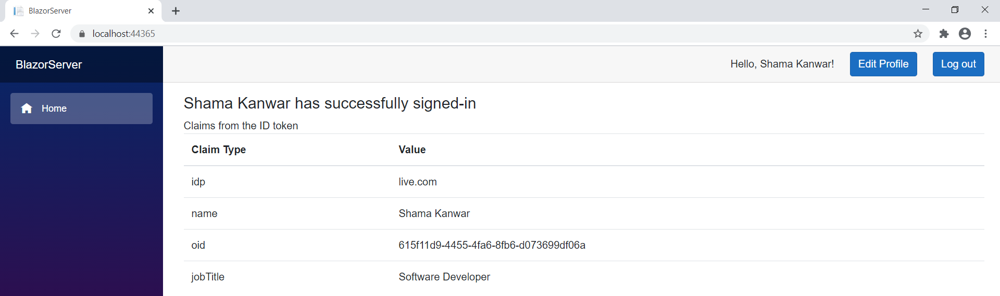

# Enable your Blazor Server to sign-in users with the Microsoft identity platform in Azure AD B2C

 1. [Overview](#overview)
 1. [Scenario](#scenario)
 1. [Prerequisites](#prerequisites)
 1. [Setup](#setup)
 1. [Registration](#registration)
 1. [Running the sample](#running-the-sample)
 1. [Explore the sample](#explore-the-sample)
 1. [About the code](#about-the-code)
 1. [Next chapter of the tutorial: the Web APP calls Microsoft Graph](#next-chapter-of-the-tutorial-the-web-app-calls-microsoft-graph)
 1. [More information](#more-information)
 1. [Community Help and Support](#community-help-and-support)
 1. [Contributing](#contributing)


## Overview

This sample demonstrates an ASP.NET Core Blazor Server standalone application that authenticates users against Azure AD B2C.

This application uses **Implicit flow** grant type provided by Microsoft identity platform.


## Scenario

1. The ASP.NET Core Blazor Server standalone app uses the [Microsoft Authentication Library](https://docs.microsoft.com/azure/active-directory/develop/msal-overview) to obtain an [ID Token](https://docs.microsoft.com/azure/active-directory/develop/id-tokens) from **Azure AD B2C**:
1. The **ID Token** proves that the user has successfully authenticated against **Azure AD B2C**.


## Prerequisites

- Either [Visual Studio](https://visualstudio.microsoft.com/downloads/) or [Visual Studio Code](https://code.visualstudio.com/download)
- System should have .NET SDK v3.1.6 or above. You can install it from [Download .NET Core 3.1](https://dotnet.microsoft.com/download/dotnet-core/3.1)
- An **Azure AD B2C** tenant. For more information see: [How to get an Azure AD B2C tenant](https://docs.microsoft.com/azure/active-directory-b2c/tutorial-create-tenant)
- A user account in your **Azure AD B2C** tenant.

## Setup

### In the downloaded folder

From your shell or command line:

```console
cd ms-identity-blazor-server\WebApp-OIDC\B2C
```

> :warning: To avoid path length limitations on Windows, we recommend cloning into a directory near the root of your drive.

## Registration

:warning: This sample comes with a pre-registered application for testing purposes. If you would like to use your own **Azure AD B2C** tenant and application, follow the steps below to register and configure the application in the **Azure portal**. Otherwise, continue with the steps for [Running the sample](#running-the-sample).

### Register the sample application(s) with your Azure Active Directory tenant

There is one project in this sample. To register it, you can follow the steps below to manually register your apps.

#### Choose the Azure AD tenant where you want to create your applications

As a first step you'll need to:

1. Sign in to the [Azure portal](https://portal.azure.com).
1. If your account is present in more than one Azure AD B2C tenant, select your profile at the top right corner in the menu on top of the page, and then **switch directory** to change your portal session to the desired Azure AD B2C tenant.

#### Create User Flows and Custom Policies

Please refer to: [Tutorial: Create user flows in Azure Active Directory B2C](https://docs.microsoft.com/azure/active-directory-b2c/tutorial-create-user-flows)

#### Add External Identity Providers

Please refer to: [Tutorial: Add identity providers to your applications in Azure Active Directory B2C](https://docs.microsoft.com/azure/active-directory-b2c/tutorial-add-identity-providers)

#### Register the web app (WebApp-blazor-server-b2c)

1. Navigate to the [Azure portal](https://portal.azure.com) and select the **Azure AD B2C** service.
1. Select the **App Registrations** blade on the left, then select **New registration**.
1. In the **Register an application page** that appears, enter your application's registration information:
   - In the **Name** section, enter a meaningful application name that will be displayed to users of the app, for example `WebApp-blazor-server-b2c`.
   - Under **Supported account types**, select **Accounts in any identity provider or organizational directory (for authenticating users with user flows)**.
   - In the **Redirect URI** section, select **Web** in the combo-box and enter the following redirect URI: `https://localhost:44365/authentication/login-callback`.
     > Note that there are more than one redirect URIs used in this sample. You'll need to add them from the **Authentication** tab later after the app has been created successfully.
1. Confirm that Permissions > **Grant admin consent to openid and offline_access permissions** is selected.
1. Select **Register** to create the application.
1. In the app's registration screen, find and note the **Application (client) ID**. You use this value in your app's configuration file(s) later in your code.
1. In the app's registration screen, select **Authentication** in the menu.
   - In the **Logout URL** section, set it to `https://localhost:44365/signout-oidc`.
   - In **Implicit grant** section,  select the check boxes for **Access tokens** and **ID tokens**.
1. Select **Save** to save your changes.

#### Configure the web app (WebApp-blazor-server-b2c) to use your app registration

Open the project in your IDE (like Visual Studio or Visual Studio Code) to configure the code.

> In the steps below, "ClientID" is the same as "Application ID" or "AppId".

1. Open the `blazorserver-B2C\appsettings.json` file.
1. Find the key `ClientId` and replace the existing value with the application ID (clientId) of the `WebApp-blazor-server-b2c` application copied from the Azure portal.
1. Find the key `Authority` and populate it with your policy authority strings e.g. `https://<your-tenant-name>.b2clogin.com/<your-tenant-name>.onmicrosoft.com/B2C_1_signupsignin`.

## Running the sample

You can run the sample by using either Visual Studio or command line interface as shown below:

### Run the sample using Visual Studio

Clean the solution, rebuild the solution, and run it.

### Run the sample using a command line interface such as VS Code integrated terminal

#### Step 1. Install .NET Core dependencies

```console
cd WebApp-OIDC\B2C
cd blazorserver-B2C
dotnet restore
```

#### Step 2. Trust development certificates

```console
dotnet dev-certs https --clean
dotnet dev-certs https --trust
```

Learn more about [HTTPS in .NET Core](https://docs.microsoft.com/aspnet/core/security/enforcing-ssl).

#### Step 3. Run the applications

In the console window execute the below command:

```console
dotnet run
```

## Explore the sample

> If you are using incognito mode of browser to run this sample then allow third party cookies.

1. Open your browser and navigate to `https://localhost:44365`.
1. Select the **Sign in** button on the top right corner. You will see claims from the signed-in user's token.



> :information_source: Did the sample not work for you as expected? Then please reach out to us using the [GitHub Issues](../../../../issues) page.

## We'd love your feedback!

Were we successful in addressing your learning objective? [Do consider taking a moment to share your experience with us.](https://forms.office.com/Pages/ResponsePage.aspx?id=v4j5cvGGr0GRqy180BHbR73pcsbpbxNJuZCMKN0lURpUMEw0UFNBVVBEV1E3VFNBU1I0T05TNzhPViQlQCN0PWcu)

## How was the code created

Create the Web App using Blazor Server template:

1. Create the Web App using Blazor Server template:

   ```console
   dotnet new blazorserver --auth IndividualB2C
   ```

1. Add `UserClaims.razor` component and `UserClaimsBase.cs` class.

## About the code

1. In `Startup.cs`, add below lines of code in **ConfigureServices** method:

    ```csharp
    services.AddMicrosoftIdentityWebAppAuthentication(Configuration, "AzureAdB2C"); 
    ```

    This enables your application to authenticate users.

1. **Index.razor** is the landing page when application starts. Index.razor contains child component called `UserClaims`. If user is authenticated successfully, `UserClaims` displays a few claims present in the ID Token issued by identity provider.

1. In the `UserClaimsBase.cs` class, **GetClaimsPrincipalData** method retrieves signed-in user's claims using the **GetAuthenticationStateAsync()** method of the **AuthenticationStateProvider** class.

     ```csharp
    public class UserClaimsBase : ComponentBase
    {
        [Inject]
        private AuthenticationStateProvider AuthenticationStateProvider { get; set; }
        protected string _authMessage;
        protected IEnumerable<Claim> _claims = Enumerable.Empty<Claim>();
        private string[] returnClaims = { "name", "idp", "oid", "jobTitle", "emails" };
        protected override async Task OnInitializedAsync()
        {
            await GetClaimsPrincipalData();
        }
        private async Task GetClaimsPrincipalData()
        {
            var authState = await AuthenticationStateProvider.GetAuthenticationStateAsync();
            var user = authState.User;
            if (user.Identity.IsAuthenticated)
            {
                _authMessage = $"{user.Identity.Name} is authenticated.";
                _claims = user.Claims.Where(x => returnClaims.Contains(x.Type));
            }
            else
            {
                _authMessage = "The user is NOT authenticated.";
            }
        }
    }
    ```

## More information

- [What is Azure Active Directory B2C?](https://docs.microsoft.com/azure/active-directory-b2c/overview)
- [Secure an ASP.NET Core Blazor WebAssembly standalone app with Azure Active Directory B2C](https://docs.microsoft.com/aspnet/core/blazor/security/webassembly/standalone-with-azure-active-directory-b2c)
- [Application types that can be used in Active Directory B2C](https://docs.microsoft.com/azure/active-directory-b2c/application-types)
- [Recommendations and best practices for Azure Active Directory B2C](https://docs.microsoft.com/azure/active-directory-b2c/best-practices)
- [Azure AD B2C session](https://docs.microsoft.com/azure/active-directory-b2c/session-overview)

For more information about how OAuth 2.0 protocols work in this scenario and other scenarios, see [Authentication Scenarios for Azure AD](https://docs.microsoft.com/azure/active-directory/develop/authentication-flows-app-scenarios).

## Community Help and Support

Use [Stack Overflow](http://stackoverflow.com/questions/tagged/msal) to get support from the community.
Ask your questions on Stack Overflow first and browse existing issues to see if someone has asked your question before.
Make sure that your questions or comments are tagged with [`azure-active-directory` `azure-ad-b2c` `ms-identity` `msal`].

If you find a bug in the sample, raise the issue on [GitHub Issues](../../../../issues).

To provide feedback on or suggest features for Azure Active Directory, visit [User Voice page](https://feedback.azure.com/forums/169401-azure-active-directory).

## Contributing

If you'd like to contribute to this sample, see [CONTRIBUTING.MD](../../CONTRIBUTING.md).

This project has adopted the [Microsoft Open Source Code of Conduct](https://opensource.microsoft.com/codeofconduct/). For more information, see the [Code of Conduct FAQ](https://opensource.microsoft.com/codeofconduct/faq/) or contact [opencode@microsoft.com](mailto:opencode@microsoft.com) with any additional questions or comments.
