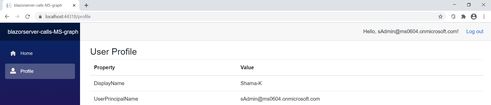

# Call Microsoft Graph on behalf-of the signed-in users in your Blazor Server Application

 1. [Overview](#overview)
 1. [Scenario](#scenario)
 1. [Contents](#contents)
 1. [Prerequisites](#prerequisites)
 1. [Setup](#setup)
 1. [Registration](#registration)
 1. [Running the sample](#running-the-sample)
 1. [Explore the sample](#explore-the-sample)
 1. [About the code](#about-the-code)
 1. [More information](#more-information)
 1. [Community Help and Support](#community-help-and-support)
 1. [Contributing](#contributing)
 1. [Code of Conduct](#code-of-conduct)


## Overview

In the second chapter, we extend our ASP .Net Core Blazor Server application to call a downstream API ([Microsoft Graph](https://aka.ms/graph)) to obtain more information about the signed-in user.

## Scenario

Continuing from  the previous chapter of the tutorial, this chapter adds the following steps:

1. The client application acquires an [Access Tokens](https://aka.ms/access-tokens) for Microsoft Graph.
1. The **Access Token** is used as a *bearer* token to authorize the user to call the [Microsoft Graph API](https://aka.ms/graph)
1. **Microsoft Graph API** responds with the resource that the user has access to.


## How to run this sample

### In the downloaded folder

From your shell or command line:

```Shell
cd ms-identity-blazor-server\WebApp-graph-user\Call-MSGraph
```

### Update the Registration for the sample application(s) with your Azure Active Directory tenant

#### Update Registration for the web app (WebApp-blazor-server)

1. In **App registrations** page, find the *WebApp-blazor-server* app.
1. In the app's registration screen, select the **Certificates & secrets** blade in the left to open the page where we can generate secrets and upload certificates.
1. In the **Client secrets** section, select **New client secret**:
   - Type a key description (for instance `app secret`),
   - Select one of the available key durations (**In 1 year**, **In 2 years**, or **Never Expires**) as per your security posture.
   - The generated key value will be displayed when you select the **Add** button. Copy the generated value for use in the steps later.
   - You'll need this key later in your code's configuration files. This key value will not be displayed again, and is not retrievable by any other means, so make sure to note it from the Azure portal before navigating to any other screen or blade.
1. In the app's registration screen, select the **API permissions** blade in the left to open the page where we add access to the APIs that your application needs.
   - Select the **Add a permission** button and then,
   - Ensure that the **Microsoft APIs** tab is selected.
   - In the *Commonly used Microsoft APIs* section, select **Microsoft Graph**
   - In the **Delegated permissions** section, select the **User.Read** in the list. Use the search box if necessary.
   - Select the **Add permissions** button at the bottom.

#### Configure the web app (WebApp-blazor-server)

Open the project in your IDE (like Visual Studio or Visual Studio Code) to configure the code.

1. Open `blazorserver-calls-MS-graph\appsettings.json` file and copy the details from the previous chapter's `WebApp-OIDC\MyOrg\blazorserver-singleOrg\appsettings.json` file.
1. Find the app key `ClientSecret` and replace the existing value with the key you saved during the creation of the `WebApp-blazor-server` app, in the Azure portal.

## Running the sample

You can run the sample by using either Visual Studio or command line interface as shown below:

### Run the sample using Visual Studio

Clean the solution, rebuild the solution, and run it.

### Run the sample using a command line interface such as VS Code integrated terminal

#### Step 1. Install .NET Core dependencies

```console
cd blazorserver-calls-MS-graph
dotnet restore
```

#### Step 2. Trust development certificates

```console
dotnet dev-certs https --clean
dotnet dev-certs https --trust
```

Learn more about [HTTPS in .NET Core](https://docs.microsoft.com/aspnet/core/security/enforcing-ssl).

#### Step 3. Run the applications

In the console window execute the below command:

```console
dotnet run
```

## Explore the sample

1. Open your browser and navigate to `https://localhost:44318`.
1. Select the **Sign in** button on the top right corner. You will see claims from the signed-in user's token.

   

1. Select **Profile** from navigation bar on the left. If user has signed-in then information fetched from Microsoft Graph is displayed, otherwise login screen will appear.

   

> :information_source: Did the sample not work for you as expected? Then please reach out to us using the [GitHub Issues](../../../../issues) page.

## We'd love your feedback!

Were we successful in addressing your learning objective? [Do consider taking a moment to share your experience with us.](https://forms.office.com/Pages/ResponsePage.aspx?id=v4j5cvGGr0GRqy180BHbR73pcsbpbxNJuZCMKN0lURpUMFJCNURBV1g2UTlKQjZTOTFGS09ZNjVMNSQlQCN0PWcu)

## About the code

> - Describe where the code uses auth libraries, or calls the graph
> - Describe specific aspects (e.g. caching, validation etc.)

## Deployment

See [README.md](../../Deploy-to-Azure/README.md) to deploy this sample to Azure.

## More information

- [Microsoft identity platform (Azure Active Directory for developers)](https://docs.microsoft.com/azure/active-directory/develop/)
- [Overview of Microsoft Authentication Library (MSAL)](https://docs.microsoft.com/azure/active-directory/develop/msal-overview)
- [Quickstart: Register an application with the Microsoft identity platform (Preview)](https://docs.microsoft.com/azure/active-directory/develop/quickstart-register-app)
- [Quickstart: Configure a client application to access web APIs (Preview)](https://docs.microsoft.com/azure/active-directory/develop/quickstart-configure-app-access-web-apis)
- [Understanding Azure AD application consent experiences](https://docs.microsoft.com/azure/active-directory/develop/application-consent-experience)
- [Understand user and admin consent](https://docs.microsoft.com/azure/active-directory/develop/howto-convert-app-to-be-multi-tenant#understand-user-and-admin-consent)
- [Application and service principal objects in Azure Active Directory](https://docs.microsoft.com/azure/active-directory/develop/app-objects-and-service-principals)
- [National Clouds](https://docs.microsoft.com/azure/active-directory/develop/authentication-national-cloud#app-registration-endpoints)
- [MSAL code samples](https://docs.microsoft.com/azure/active-directory/develop/sample-v2-code)
    // Add MSAL.NET and/or Identity.Web Docs

For more information about how OAuth 2.0 protocols work in this scenario and other scenarios, see [Authentication Scenarios for Azure AD](https://docs.microsoft.com/azure/active-directory/develop/authentication-flows-app-scenarios).

## Community Help and Support

Use [Stack Overflow](http://stackoverflow.com/questions/tagged/msal) to get support from the community.
Ask your questions on Stack Overflow first and browse existing issues to see if someone has asked your question before.
Make sure that your questions or comments are tagged with [`azure-active-directory` `azure-ad-b2c` `ms-identity` `msal`].

If you find a bug in the sample, raise the issue on [GitHub Issues](../../issues).

To provide feedback on or suggest features for Azure Active Directory, visit [User Voice page](https://feedback.azure.com/forums/169401-azure-active-directory).

## Contributing

If you'd like to contribute to this sample, see [CONTRIBUTING.MD](/CONTRIBUTING.md).

This project has adopted the [Microsoft Open Source Code of Conduct](https://opensource.microsoft.com/codeofconduct/). For more information, see the [Code of Conduct FAQ](https://opensource.microsoft.com/codeofconduct/faq/) or contact [opencode@microsoft.com](mailto:opencode@microsoft.com) with any additional questions or comments.