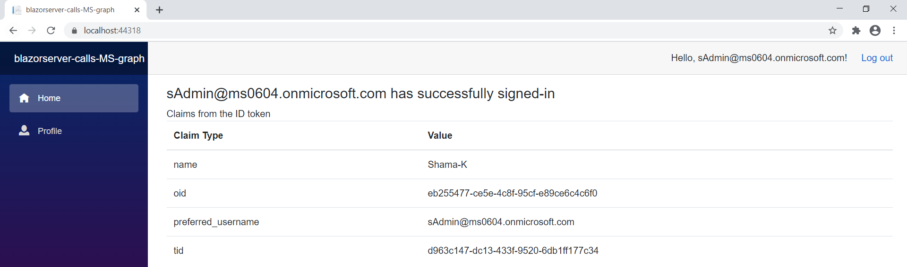

# Call Microsoft Graph on behalf-of the signed-in users in your Blazor Server Application

 1. [Overview](#overview)
 1. [Scenario](#scenario)
 1. [Contents](#contents)
 1. [Prerequisites](#prerequisites)
 1. [Setup](#setup)
 1. [Registration](#registration)
 1. [Running the sample](#running-the-sample)
 1. [Explore the sample](#explore-the-sample)
 1. [About the code](#about-the-code)
 1. [Deployment](#deployment)
 1. [More information](#more-information)
 1. [Community Help and Support](#community-help-and-support)
 1. [Contributing](#contributing)
 1. [Code of Conduct](#code-of-conduct)


## Overview

This sample demonstrates an ASP.NET Core Blazor Server application that authenticates users with [Azure Active Directory (Azure AD)](https://docs.microsoft.com/azure/active-directory/fundamentals/active-directory-whatis). It then acquires an [Access Token](https://docs.microsoft.com/azure/active-directory/develop/access-tokens) for Microsoft Graph and calls the [Microsoft Graph API](https://docs.microsoft.com/graph/overview).

## Scenario

1. The client ASP.NET Core Blazor Server application uses the Microsoft Authentication Library [MSAL.Net](https://github.com/AzureAD/microsoft-authentication-library-for-dotnet) and [Microsoft.Identity.Web](https://github.com/AzureAD/microsoft-identity-web) libraries to obtain an [Access Token](https://docs.microsoft.com/azure/active-directory/develop/access-tokens) from **Azure AD**.
1. The client application acquires an Access Token for Microsoft Graph.
1. The **Access Token** is used as a *bearer* token to authorize the user to call the [Microsoft Graph API](https://docs.microsoft.com/graph/overview)
1. **Microsoft Graph API** responds with the resource that the user has access to.


## Prerequisites

- Either [Visual Studio](https://visualstudio.microsoft.com/downloads/) or [Visual Studio Code](https://code.visualstudio.com/download) and [.NET Core SDK](https://www.microsoft.com/net/learn/get-started)
- An **Azure AD** tenant. For more information see: [How to get an Azure AD tenant](https://docs.microsoft.com/azure/active-directory/develop/quickstart-create-new-tenant)
- A user account in your **Azure AD** tenant. This sample will not work with a **personal Microsoft account**. Therefore, if you signed in to the [Azure portal](https://portal.azure.com) with a personal account and have never created a user account in your directory before, you need to do that now.

## Setup

### In the downloaded folder

From your shell or command line:

```console
cd ms-identity-blazor-server\WebApp-graph-user\Call-MSGraph
```

> :warning: To avoid path length limitations on Windows, we recommend cloning into a directory near the root of your drive.

### Register the sample application(s) with your Azure Active Directory tenant

There is one project in this sample. To register it, you can:

- follow the steps below for manually register your apps
- or use PowerShell scripts that:
  - **automatically** creates the Azure AD applications and related objects (passwords, permissions, dependencies) for you.
  - modify the projects' configuration files.

<details>
  <summary>Expand this section if you want to use this automation:</summary>

> :warning: If you have never used **Azure AD Powershell** before, we recommend you go through the [App Creation Scripts](./AppCreationScripts/AppCreationScripts.md) once to ensure that your environment is prepared correctly for this step.

1. On Windows, run PowerShell as **Administrator** and navigate to the root of the cloned directory
1. In PowerShell run:

   ```PowerShell
   Set-ExecutionPolicy -ExecutionPolicy RemoteSigned -Scope Process -Force
   ```

1. Run the script to create your Azure AD application and configure the code of the sample application accordingly.
1. In PowerShell run:

   ```PowerShell
   cd .\AppCreationScripts\
   .\Configure.ps1
   ```

   > Other ways of running the scripts are described in [App Creation Scripts](./AppCreationScripts/AppCreationScripts.md)
   > The scripts also provide a guide to automated application registration, configuration and removal which can help in your CI/CD scenarios.

</details>

### Choose the Azure AD tenant where you want to create your applications

As a first step you'll need to:

1. Sign in to the [Azure portal](https://portal.azure.com).
1. If your account is present in more than one Azure AD tenant, select your profile at the top right corner in the menu on top of the page, and then **switch directory** to change your portal session to the desired Azure AD tenant.

### Register the webApp app (WebApp-blazor-server)

1. Navigate to the [Azure portal](https://portal.azure.com) and select the **Azure AD** service.
1. Select the **App Registrations** blade on the left, then select **New registration**.
1. In the **Register an application page** that appears, enter your application's registration information:
   - In the **Name** section, enter a meaningful application name that will be displayed to users of the app, for example `WebApp-blazor-server`.
   - Under **Supported account types**, select **Accounts in this organizational directory only**.
   - In the **Redirect URI (optional)** section, select **Web** in the combo-box and enter the following redirect URI: `https://localhost:44318/`.
     > Note that there are more than one redirect URIs used in this sample. You'll need to add them from the **Authentication** tab later after the app has been created successfully.
1. Select **Register** to create the application.
1. In the app's registration screen, find and note the **Application (client) ID**. You use this value in your app's configuration file(s) later in your code.
1. In the app's registration screen, select **Authentication** in the menu.
   - If you don't have a platform added, select **Add a platform** and select the **Web** option.
   - In the **Redirect URIs** section, enter the following redirect URIs.
      - `https://localhost:44318/signin-oidc`
   - In the **Logout URL** section, set it to `https://localhost:44318/signout-oidc`.
1. In the app's registration screen, select the **Certificates & secrets** blade in the left to open the page where we can generate secrets and upload certificates.
1. In the **Client secrets** section, select **New client secret**:
   - Type a key description (for instance `app secret`),
   - Select one of the available key durations (**In 1 year**, **In 2 years**, or **Never Expires**) as per your security posture.
   - The generated key value will be displayed when you select the **Add** button. Copy the generated value for use in the steps later.
   - You'll need this key later in your code's configuration files. This key value will not be displayed again, and is not retrievable by any other means, so make sure to note it from the Azure portal before navigating to any other screen or blade.
1. In the app's registration screen, select the **API permissions** blade in the left to open the page where we add access to the APIs that your application needs.
   - Select the **Add a permission** button and then,
   - Ensure that the **Microsoft APIs** tab is selected.
   - In the *Commonly used Microsoft APIs* section, select **Microsoft Graph**
   - In the **Delegated permissions** section, select the **User.Read** in the list. Use the search box if necessary.
   - Select the **Add permissions** button at the bottom.
1. Select **Save** to save your changes.

#### Configure the webApp app (WebApp-blazor-server) to use your app registration

Open the project in your IDE (like Visual Studio or Visual Studio Code) to configure the code.

> In the steps below, "ClientID" is the same as "Application ID" or "AppId".

1. Open the `appsettings.json` file.
1. Find the key `ClientId` and replace the existing value with the application ID (clientId) of the `WebApp-blazor-server` application copied from the Azure portal.
1. Find the key `TenantId` and replace the existing value with your Azure AD tenant ID.
1. Find the key `Domain` and replace the existing value with your Azure AD tenant name.
1. Find the app key `ClientSecret` and replace the existing value with the key you saved during the creation of the `WebApp-blazor-server` app, in the Azure portal.

## Running the sample

You can run the sample by using either Visual Studio or command line interface as shown below:

### Run the sample using Visual Studio

Clean the solution, rebuild the solution, and run it.

### Run the sample using a command line interface such as VS Code integrated terminal

#### Step 1. Install .NET Core dependencies

```console
cd blazorserver-calls-MS-graph
dotnet restore
```

#### Step 2. Trust development certificates

```console
dotnet dev-certs https --clean
dotnet dev-certs https --trust
```

Learn more about [HTTPS in .NET Core](https://docs.microsoft.com/aspnet/core/security/enforcing-ssl).

#### Step 3. Run the applications

In the console window execute the below command:

```console
dotnet run
```

## Explore the sample

1. Open your browser and navigate to `https://localhost:44318`.
1. Select the **Sign in** button on the top right corner. When the user signs-in for the first time , a consent screen is presented with required permissions, select **Accept**. You will see claims from the signed-in user's token.

   

1. Select **Profile** from navigation bar on the left. If user has signed-in then information fetched from Microsoft Graph is displayed, otherwise login screen will appear.

   

> :information_source: Did the sample not work for you as expected? Then please reach out to us using the [GitHub Issues](../../../../issues) page.

## We'd love your feedback!

Were we successful in addressing your learning objective? [Do consider taking a moment to share your experience with us.](https://forms.office.com/Pages/ResponsePage.aspx?id=v4j5cvGGr0GRqy180BHbR73pcsbpbxNJuZCMKN0lURpUMFJCNURBV1g2UTlKQjZTOTFGS09ZNjVMNSQlQCN0PWcu)

## About the code

1. In `Startup.cs`, add below lines of code in **ConfigureServices** method:

    ```csharp
   services.AddAuthentication(OpenIdConnectDefaults.AuthenticationScheme)
            .AddMicrosoftIdentityWebApp(Configuration.GetSection("AzureAd"))
            .EnableTokenAcquisitionToCallDownstreamApi(initialScopes)
            .AddMicrosoftGraph(Configuration.GetSection("DownstreamApi"))
            .AddInMemoryTokenCaches();
    ```

    This enables your application to use the Microsoft identity platform endpoint to sign-in users and to call Microsoft Graph API.

1. **Index.razor** is the landing page when application starts. Index.razor contains child component called `UserClaims`. If user is authenticated successfully, `UserClaims` displays a few claims present in the ID Token issued by Azure AD.

1. In the `UserClaimsBase.cs` class, **GetClaimsPrincipalData** method retrieves signed-in user's claims using the **GetAuthenticationStateAsync()** method of the **AuthenticationStateProvider** class.

     ```csharp
    public class UserClaimsBase : ComponentBase
    {
        [Inject]
        private AuthenticationStateProvider AuthenticationStateProvider { get; set; }
        protected string _authMessage;
        protected IEnumerable<Claim> _claims = Enumerable.Empty<Claim>();
        private string[] returnClaims = { "name", "preferred_username", "tid", "oid" };
        protected override async Task OnInitializedAsync()
        {
            await GetClaimsPrincipalData();
        }
        private async Task GetClaimsPrincipalData()
        {
            var authState = await AuthenticationStateProvider.GetAuthenticationStateAsync();
            var user = authState.User;
            if (user.Identity.IsAuthenticated)
            {
                _authMessage = $"{user.Identity.Name} is authenticated.";
                _claims = user.Claims.Where(x => returnClaims.Contains(x.Type));
            }
            else
            {
                _authMessage = "The user is NOT authenticated.";
            }
        }
    }
    ```

1. **UserProfile.razor** component displays user information retrieved by **GetUserProfile** method of **UserProfileBase.cs**.

    `UserProfileBase.cs` calls Microsoft Graph `/me` endpoint to retrieve user information.

    ```csharp
    public class UserProfileBase : ComponentBase
    {
        [Inject]
        GraphServiceClient GraphClient { get; set; }
        [Inject]
        MicrosoftIdentityConsentAndConditionalAccessHandler ConsentHandler { get; set; }

        protected User _user = new User();
        protected override async Task OnInitializedAsync()
        {
            await GetUserProfile();
        }
        private async Task GetUserProfile()
        {
            try
            {
                var request = GraphClient.Me.Request();
                _user = await request.GetAsync();
            }
            catch (Exception ex)
            {
                Console.WriteLine(ex.Message);
                ConsentHandler.HandleException(ex);
            }
        }
    }
    ```

## Deployment

See [README.md](../../Deploy-to-Azure/README.md) to deploy this sample to Azure.

## More information

- [Microsoft identity platform (Azure Active Directory for developers)](https://docs.microsoft.com/azure/active-directory/develop/)
- [Overview of Microsoft Authentication Library (MSAL)](https://docs.microsoft.com/azure/active-directory/develop/msal-overview)
- [Quickstart: Register an application with the Microsoft identity platform (Preview)](https://docs.microsoft.com/azure/active-directory/develop/quickstart-register-app)
- [Quickstart: Configure a client application to access web APIs (Preview)](https://docs.microsoft.com/azure/active-directory/develop/quickstart-configure-app-access-web-apis)

For more information about how OAuth 2.0 protocols work in this scenario and other scenarios, see [Authentication Scenarios for Azure AD](https://docs.microsoft.com/azure/active-directory/develop/authentication-flows-app-scenarios).

## Community Help and Support

Use [Stack Overflow](http://stackoverflow.com/questions/tagged/msal) to get support from the community.
Ask your questions on Stack Overflow first and browse existing issues to see if someone has asked your question before.
Make sure that your questions or comments are tagged with [`azure-active-directory` `azure-ad-b2c` `ms-identity` `msal`].

If you find a bug in the sample, raise the issue on [GitHub Issues](../../../../issues).

To provide feedback on or suggest features for Azure Active Directory, visit [User Voice page](https://feedback.azure.com/forums/169401-azure-active-directory).

## Contributing

If you'd like to contribute to this sample, see [CONTRIBUTING.MD](/CONTRIBUTING.md).

This project has adopted the [Microsoft Open Source Code of Conduct](https://opensource.microsoft.com/codeofconduct/). For more information, see the [Code of Conduct FAQ](https://opensource.microsoft.com/codeofconduct/faq/) or contact [opencode@microsoft.com](mailto:opencode@microsoft.com) with any additional questions or comments.