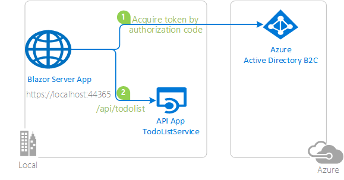
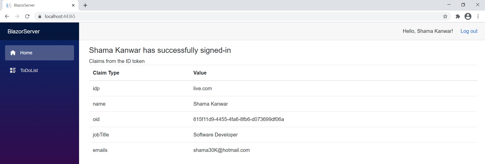
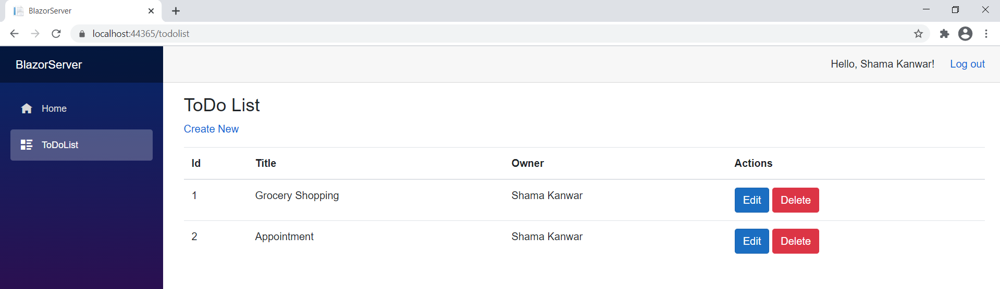

# Enable your Blazor Server to sign-in users and call web API with the Microsoft identity platform in Azure AD B2C

 1. [Overview](#overview)
 1. [Scenario](#scenario)
 1. [Contents](#contents)
 1. [Prerequisites](#prerequisites)
 1. [Setup](#setup)
 1. [Registration](#registration)
 1. [Running the sample](#running-the-sample)
 1. [Explore the sample](#explore-the-sample)
 1. [About the code](#about-the-code)
 1. [More information](#more-information)
 1. [Community Help and Support](#community-help-and-support)
 1. [Contributing](#contributing)
 1. [Code of Conduct](#code-of-conduct)


## Overview

In the second chapter, we extend our ASP.NET Core Blazor Server application to call a downstream ASP.NET Core web API that is secured using Azure AD B2C.

## Scenario

Continuing from  the [previous chapter](../../WebApp-OIDC/B2C/README.md) of the tutorial, this chapter adds the following steps:

1. The client application acquires an [Access Token](https://aka.ms/access-tokens) for the Web API.
1. The **Access Token** is used as a *bearer* token to authorize the user to call secure ASP.NET Core web API.



## How to run this sample

### In the downloaded folder

From your shell or command line:

```console
cd ms-identity-blazor-server\WebApp-your-API\B2C
```

### Register the service app (ToDoListService-aspnetcore)

1. Navigate to the [Azure portal](https://portal.azure.com) and select the **Azure AD B2C** service.
1. Select the **App Registrations** blade on the left, then select **New registration**.
1. In the **Register an application page** that appears, enter your application's registration information:
   - In the **Name** section, enter a meaningful application name that will be displayed to users of the app, for example `ToDoListService-aspnetcore`.
   - Under **Supported account types**, select **Accounts in any identity provider or organizational directory (for authenticating users with user flows)**.
1. Select **Register** to create the application.
1. In the app's registration screen, find and note the **Application (client) ID**. You use this value in your app's configuration file(s) later in your code.
1. Select **Save** to save your changes.
1. In the app's registration screen, select the **Expose an API** blade to the left to open the page where you can declare the parameters to expose this app as an Api for which client applications can obtain [access tokens](https://aka.ms/access-tokens) for.
The first thing that we need to do is to declare the unique [resource](https://docs.microsoft.com/azure/active-directory/develop/v2-oauth2-auth-code-flow) URI that the clients will be using to obtain access tokens for this Api. To declare an resource URI, follow the following steps:
   - Select `Set` next to the **Application ID URI** to generate a URI that is unique for this app.
   - For this sample, accept the proposed Application ID URI (`https://{tenantName}.onmicrosoft.com/{clientId}`) by selecting **Save**.
1. All Apis have to publish a minimum of one [scope](https://docs.microsoft.com/azure/active-directory/develop/v2-oauth2-auth-code-flow#request-an-authorization-code) for the client's to obtain an access token successfully. To publish a scope, follow the following steps:
   - Select **Add a scope** button open the **Add a scope** screen and Enter the values as indicated below:
        - For **Scope name**, use `access_as_user`.
        - For **Admin consent display name** type `Access TodoListService-aspnetcore-webapi`.
        - For **Admin consent description** type `Allows the app to access TodoListService-aspnetcore-webapi as the signed-in user.`
        - Keep **State** as **Enabled**.
        - Select the **Add scope** button on the bottom to save this scope.

#### Configure the service app (ToDoListService-aspnetcore) to use your app registration

Open the project in your IDE (like Visual Studio or Visual Studio Code) to configure the code.

> In the steps below, "ClientID" is the same as "Application ID" or "AppId".

1. Open the `Service\appsettings.json` file.
1. Find the key `Instance` and replace the value with your tenant name. For example, `https://fabrikam.b2clogin.com`
1. Find the key `ClientId` and replace the existing value with the application ID (clientId) of the `ToDoListService-aspnetcore` application copied from the Azure portal.
1. Find the key `Domain` and replace the existing value with your Azure AD tenant name.
1. Find the key `SignedOutCallbackPath` and add the name of the `Sign up and sign in` policy you created.
1. Find the key `SignUpSignInPolicyId` and replace with the name of the `Sign up and sign in` policy you created.

### Update the registration for the web app (WebApp-calls-API-blazor-server)

1. In **App registrations** page, find the *WebApp-calls-API-blazor-server* app.
1. In the app's registration screen, select the **Certificates & secrets** blade in the left to open the page where we can generate secrets and upload certificates.
1. In the **Client secrets** section, select **New client secret**:
   - Type a key description (for instance `app secret`),
   - Select one of the available key durations (**In 1 year**, **In 2 years**, or **Never Expires**) as per your security posture.
   - The generated key value will be displayed when you select the **Add** button. Copy the generated value for use in the steps later.
   - You'll need this key later in your code's configuration files. This key value will not be displayed again, and is not retrievable by any other means, so make sure to note it from the Azure portal before navigating to any other screen or blade.
1. In the app's registration screen, select the **API permissions** blade in the left to open the page where we add access to the APIs that your application needs.
   - Select the **Add a permission** button and then,
   - Ensure that the **My APIs** tab is selected.
   - In the list of APIs, select the API `ToDoListService-aspnetcore`.
   - In the **Delegated permissions** section, select the **Access 'ToDoListService-aspnetcore'** in the list. Use the search box if necessary.
   - Select the **Add permissions** button at the bottom.
   - Select **Grant admin consent**.

#### Configure the web app (WebApp-calls-API-blazor-server) to use your app registration

Open the project in your IDE (like Visual Studio or Visual Studio Code) to configure the code.

> In the steps below, "ClientID" is the same as "Application ID" or "AppId".

1. Open `WebApp-your-API\B2C\Client\appsettings.json` file and copy the keys from "AzureAd" section of previous chapter's `WebApp-OIDC\B2C\blazorserver-B2C\appsettings.json` file.
1. Find the key `ClientSecret` and replace the existing value with the key you saved during the creation of the `WebApp-calls-API-blazor-server` app, in the Azure portal.
1. Find the key `TodoListScope` and replace the value with API Scope defined in the Azure portal.
1. Find the key `TodoListBaseAddress` and replace the existing value with the base address of the ToDoListService-aspnetcore project (by default `https://localhost:44332`).

## Running the sample

You can run the sample by using either Visual Studio or command line interface as shown below:

### Run the sample using Visual Studio

Clean the solution, rebuild the solution, and run it. You might want to go into the solution properties and set both projects as startup projects, with the service project starting first.

When you start the web API from Visual Studio, depending on the browser you use, you'll get:

- an empty web page (with Microsoft Edge)
- or an error HTTP 401 (with Chrome)

This behavior is expected as the browser is not authenticated. The Web application will be authenticated, so it will be able to access the web API.

### Run the sample using a command line interface such as VS Code integrated terminal

#### Step 1. Install .NET Core dependencies

```console
cd Client
dotnet restore
```

Then:  
In a separate console window, execute the following commands

```console
cd Service
dotnet restore
```

#### Step 2. Trust development certificates

```console
dotnet dev-certs https --clean
dotnet dev-certs https --trust
```

Learn more about [HTTPS in .NET Core](https://docs.microsoft.com/aspnet/core/security/enforcing-ssl).

#### Step 3. Run the applications

In both the console windows execute the below command:

```console
dotnet run
```

## Explore the sample

> If you are using incognito mode of browser to run this sample then allow third party cookies.

1. Open your browser and navigate to `https://localhost:44365`.
1. Select the **Sign in** button on the top right corner. You will see claims from the signed-in user's token.

    
1. Select ToDoList from navigation bar and you can create, edit or delete the todo list items.

   

> :information_source: Did the sample not work for you as expected? Then please reach out to us using the [GitHub Issues](../../../../issues) page.

## We'd love your feedback!

Were we successful in addressing your learning objective? [Do consider taking a moment to share your experience with us.](https://forms.office.com/Pages/ResponsePage.aspx?id=v4j5cvGGr0GRqy180BHbR73pcsbpbxNJuZCMKN0lURpUMEw0UFNBVVBEV1E3VFNBU1I0T05TNzhPViQlQCN0PWcu)

## About the code

1. In `Startup.cs`, add below lines of code in **ConfigureServices** method:

    ```csharp
   services.AddMicrosoftIdentityWebAppAuthentication(Configuration, "AzureAdB2C")
            .EnableTokenAcquisitionToCallDownstreamApi(new string[] { Configuration["TodoList:TodoListScope"] })
            .AddInMemoryTokenCaches();
    ```

    This enables your application to use the Microsoft identity platform endpoint to sign-in users and to call the protected web API.

    The following code registers client service to use the HttpClient by dependency injection.

    ```csharp
   services.AddToDoListService(Configuration);
    ```

    Below code adds the incremental consent and conditional access handler for Blazor server side pages.

    ```csharp
    services.AddServerSideBlazor()
                .AddMicrosoftIdentityConsentHandler();
    ```

1. **ToDoList.razor** component displays list of items created by signed-in user. List can be updated and deleted.

    `ToDoListBase.cs` calls **GetToDoListService** method to retrieve the todo list.

    ```csharp
    public class ToDoListBase : ComponentBase
    {
        [Inject]
        ToDoListService ToDoListService { get; set; }
        [Inject]
        MicrosoftIdentityConsentAndConditionalAccessHandler ConsentHandler { get; set; }
        [Inject]
        NavigationManager Navigation { get; set; }
        protected IEnumerable<ToDo> toDoList = new List<ToDo>();
        protected ToDo toDo = new ToDo();
        protected override async Task OnInitializedAsync()
        {
            await GetToDoListService();
        }
        [AuthorizeForScopes(ScopeKeySection = "TodoList:TodoListScope")]
        private async Task GetToDoListService()
        {
            try
            {
                toDoList = await ToDoListService.GetAsync();
            }
            catch (Exception ex)
            {
                Console.WriteLine(ex.Message);
                ConsentHandler.HandleException(ex);
            }
        }
        protected async Task DeleteItem(int Id)
        {
            await ToDoListService.DeleteAsync(Id);
            await GetToDoListService();
        }
    }
    ```

1. `ToDoListService.cs` class in client project defines method to call protected API.
    **PrepareAuthenticatedClient** method retrieves the Access Token for the web API and sets authorization and accept headers for the request.

    ```csharp
    private async Task PrepareAuthenticatedClient()
    {
        var accessToken = await _tokenAcquisition.GetAccessTokenForUserAsync(new[] { _TodoListScope });
        Debug.WriteLine($"access token-{accessToken}");
        _httpClient.DefaultRequestHeaders.Authorization = new AuthenticationHeaderValue("Bearer", accessToken);
        _httpClient.DefaultRequestHeaders.Accept.Add(new MediaTypeWithQualityHeaderValue("application/json"));
    }
    ```

## More information

- [What is Azure Active Directory B2C?](https://docs.microsoft.com/azure/active-directory-b2c/overview)
- [Application types that can be used in Active Directory B2C](https://docs.microsoft.com/azure/active-directory-b2c/application-types)
- [Recommendations and best practices for Azure Active Directory B2C](https://docs.microsoft.com/azure/active-directory-b2c/best-practices)
- [Azure AD B2C session](https://docs.microsoft.com/azure/active-directory-b2c/session-overview)
- [Secure ASP.NET Core Blazor Server apps](https://docs.microsoft.com/aspnet/core/blazor/security/server/?view=aspnetcore-5.0&tabs=visual-studio)
- [ASP.NET Core Blazor Server additional security scenarios](https://docs.microsoft.com/aspnet/core/blazor/security/server/additional-scenarios?view=aspnetcore-5.0)

For more information about how OAuth 2.0 protocols work in this scenario and other scenarios, see [Authentication Scenarios for Azure AD](https://docs.microsoft.com/azure/active-directory/develop/authentication-flows-app-scenarios).

## Community Help and Support

Use [Stack Overflow](http://stackoverflow.com/questions/tagged/msal) to get support from the community.
Ask your questions on Stack Overflow first and browse existing issues to see if someone has asked your question before.
Make sure that your questions or comments are tagged with [`azure-active-directory` `azure-ad-b2c` `ms-identity` `msal`].

If you find a bug in the sample, raise the issue on [GitHub Issues](../../../../issues).

To provide feedback on or suggest features for Azure Active Directory, visit [User Voice page](https://feedback.azure.com/forums/169401-azure-active-directory).

## Contributing

If you'd like to contribute to this sample, see [CONTRIBUTING.MD](/CONTRIBUTING.md).

This project has adopted the [Microsoft Open Source Code of Conduct](https://opensource.microsoft.com/codeofconduct/). For more information, see the [Code of Conduct FAQ](https://opensource.microsoft.com/codeofconduct/faq/) or contact [opencode@microsoft.com](mailto:opencode@microsoft.com) with any additional questions or comments.