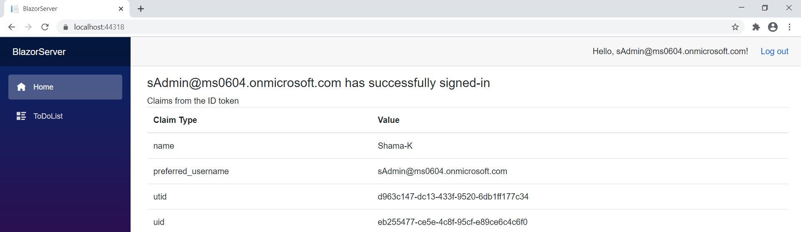

# Enable your Blazor Server to sign-in users and call Web API with the Microsoft identity platform

 1. [Overview](#overview)
 1. [Scenario](#scenario)
 1. [Contents](#contents)
 1. [Prerequisites](#prerequisites)
 1. [Setup](#setup)
 1. [Registration](#registration)
 1. [Running the sample](#running-the-sample)
 1. [Explore the sample](#explore-the-sample)
 1. [About the code](#about-the-code)
 1. [Deployment](#deployment)
 1. [More information](#more-information)
 1. [Community Help and Support](#community-help-and-support)
 1. [Contributing](#contributing)
 1. [Code of Conduct](#code-of-conduct)


## Overview

This sample demonstrates an ASP.NET Core Blazor Server application calling an ASP.NET Core Web API that is secured using Azure AD.

## Scenario

1. Secure an ASP.NET Core Web API with the Microsoft identity platform.
1. The client ASP.NET Core Blazor Server application uses the Microsoft Authentication Library [MSAL.Net](https://github.com/AzureAD/microsoft-authentication-library-for-dotnet) and [Microsoft.Identity.Web](https://github.com/AzureAD/microsoft-identity-web) libraries to sign-in and obtain a JWT [Access Token](https://aka.ms/access-tokens) from **Azure AD**.
1. The **Access Token** is used as a *bearer* token to authorize the user to call the Web API.


## Prerequisites

- [Visual Studio](https://visualstudio.microsoft.com/downloads/)
- An **Azure AD** tenant. For more information see: [How to get an Azure AD tenant](https://docs.microsoft.com/azure/active-directory/develop/quickstart-create-new-tenant)
- A user account in your **Azure AD** tenant. This sample will not work with a **personal Microsoft account**. Therefore, if you signed in to the [Azure portal](https://portal.azure.com) with a personal account and have never created a user account in your directory before, you need to do that now.

## Setup

### In the downloaded folder

From your shell or command line:

```console
cd ms-identity-blazor-server\WebApp-your-API\MyOrg
```

### Register the sample application(s) with your Azure Active Directory tenant

There are two projects in this sample. Each needs to be separately registered in your Azure AD tenant. To register these projects, you can:

- follow the steps below for manually register your apps
- or use PowerShell scripts that:
  - **automatically** creates the Azure AD applications and related objects (passwords, permissions, dependencies) for you.
  - modify the projects' configuration files.

<details>
  <summary>Expand this section if you want to use this automation:</summary>

> :warning: If you have never used **Azure AD Powershell** before, we recommend you go through the [App Creation Scripts](./AppCreationScripts/AppCreationScripts.md) once to ensure that your environment is prepared correctly for this step.

1. On Windows, run PowerShell as **Administrator** and navigate to the root of the cloned directory
1. If you have never used Azure AD Powershell before, we recommend you go through the [App Creation Scripts](./AppCreationScripts/AppCreationScripts.md) once to ensure that your environment is prepared correctly for this step.
1. In PowerShell run:

   ```PowerShell
   Set-ExecutionPolicy -ExecutionPolicy RemoteSigned -Scope Process -Force
   ```

1. Run the script to create your Azure AD application and configure the code of the sample application accordingly.
1. In PowerShell run:

   ```PowerShell
   cd .\AppCreationScripts\
   .\Configure.ps1
   ```

   > Other ways of running the scripts are described in [App Creation Scripts](./AppCreationScripts/AppCreationScripts.md)
   > The scripts also provide a guide to automated application registration, configuration and removal which can help in your CI/CD scenarios.

</details>

### Choose the Azure AD tenant where you want to create your applications

As a first step you'll need to:

1. Sign in to the [Azure portal](https://portal.azure.com).
1. If your account is present in more than one Azure AD tenant, select your profile at the top right corner in the menu on top of the page, and then **switch directory** to change your portal session to the desired Azure AD tenant.

#### Register the service app (TodoListService-aspnetcore)

1. Navigate to the [Azure portal](https://portal.azure.com) and select the **Azure Active Directory** service.
1. Select the **App Registrations** blade on the left, then select **New registration**.
1. In the **Register an application page** that appears, enter your application's registration information:
    1. In the **Name** section, enter a meaningful application name that will be displayed to users of the app, for example `TodoListService-aspnetcore-webapi`.
    1. Under **Supported account types**, select **Accounts in this organizational directory only**
    1. Select **Register** to create the application.
1. In the **Overview** blade, find and note the **Application (client) ID**. You use this value in your app's configuration file(s) later in your code.
1. In the app's registration screen, select the **Expose an API** blade to the left to open the page where you can publish the permission as an API for which client applications can obtain [access tokens](https://aka.ms/access-tokens) for. The first thing that we need to do is to declare the unique [resource](https://docs.microsoft.com/azure/active-directory/develop/v2-oauth2-auth-code-flow) URI that the clients will be using to obtain access tokens for this API. To declare an resource URI(Application ID URI), follow the following steps:
    1. Select **Set** next to the **Application ID URI** to generate a URI that is unique for this app.
    1. For this sample, accept the proposed Application ID URI (`api://{clientId}`) by selecting **Save**. Read more about Application ID URI at [Validation differences by supported account types \(signInAudience\)](https://docs.microsoft.com/azure/active-directory/develop/supported-accounts-validation).

##### Publish Delegated Permissions

1. All APIs must publish a minimum of one [scope](https://docs.microsoft.com/azure/active-directory/develop/v2-oauth2-auth-code-flow#request-an-authorization-code), also called [Delegated Permission](https://docs.microsoft.com/azure/active-directory/develop/v2-permissions-and-consent#permission-types), for the client apps to obtain an access token for a *user* successfully. To publish a scope, follow these steps:
1. Select **Add a scope** button open the **Add a scope** screen and Enter the values as indicated below:
    1. For **Scope name**, use `ToDoList.Read`.
    1. Select **Admins and users** options for **Who can consent?**.
    1. For **Admin consent display name** type in *Read users ToDo list using the 'TodoListService-aspnetcore-webapi'*.
    1. For **Admin consent description** type in *Allow the app to read the user's ToDo list using the 'TodoListService-aspnetcore-webapi'*.
    1. For **User consent display name** type in *Read your ToDo list items via the 'TodoListService-aspnetcore-webapi'*.
    1. For **User consent description** type in *Allow the app to read your ToDo list items via the 'TodoListService-aspnetcore-webapi'*.
    1. Keep **State** as **Enabled**.
    1. Select the **Add scope** button on the bottom to save this scope.
    > Repeat the steps above for another scope named **ToDoList.ReadWrite**
1. Select the **Manifest** blade on the left.
    1. Set `accessTokenAcceptedVersion` property to **2**.
    1. Select on **Save**.

> :information_source:  Follow [the principle of least privilege when publishing permissions](https://learn.microsoft.com/security/zero-trust/develop/protected-api-example) for a web API.

##### Publish Application Permissions

1. All APIs should publish a minimum of one [App role for applications](https://docs.microsoft.com/azure/active-directory/develop/howto-add-app-roles-in-azure-ad-apps#assign-app-roles-to-applications), also called [Application Permission](https://docs.microsoft.com/azure/active-directory/develop/v2-permissions-and-consent#permission-types), for the client apps to obtain an access token as *themselves*, i.e. when they are not signing-in a user. **Application permissions** are the type of permissions that APIs should publish when they want to enable client applications to successfully authenticate as themselves and not need to sign-in users. To publish an application permission, follow these steps:
1. Still on the same app registration, select the **App roles** blade to the left.
1. Select **Create app role**:
    1. For **Display name**, enter a suitable name for your application permission, for instance **ToDoList.Read.All**.
    1. For **Allowed member types**, choose **Application** to ensure other applications can be granted this permission.
    1. For **Value**, enter **ToDoList.Read.All**.
    1. For **Description**, enter *Allow the app to read every user's ToDo list using the 'TodoListService-aspnetcore-webapi'*.
    1. Select **Apply** to save your changes.

    > Repeat the steps above for another app permission named **ToDoList.ReadWrite.All**

##### Configure Optional Claims

1. Still on the same app registration, select the **Token configuration** blade to the left.
1. Select **Add optional claim**:
    1. Select **optional claim type**, then choose **Access**.
     1. Select the optional claim **idtyp**.
    > Indicates token type. This claim is the most accurate way for an API to determine if a token is an app token or an app+user token. This is not issued in tokens issued to users.
    1. Select **Add** to save your changes.

#### Configure the service app (ToDoListService-aspnetcore) to use your app registration

Open the project in your IDE (like Visual Studio or Visual Studio Code) to configure the code.

> In the steps below, "ClientID" is the same as "Application ID" or "AppId".

1. Open the `Service\appsettings.json` file.
1. Find the key `Domain` and replace the existing value with your Azure AD tenant name.
1. Find the key `TenantId` and replace the existing value with your Azure AD tenant ID.
1. Find the key `ClientId` and replace the existing value with the application ID (clientId) of the `ToDoListService-aspnetcore` application copied from the Azure portal.

### Register the web app (WebApp-calls-API-blazor-server)

1. Navigate to the [Azure portal](https://portal.azure.com) and select the **Azure AD** service.
1. Select the **App Registrations** blade on the left, then select **New registration**.
1. In the **Register an application page** that appears, enter your application's registration information:
   - In the **Name** section, enter a meaningful application name that will be displayed to users of the app, for example `WebApp-calls-API-blazor-server`.
   - Under **Supported account types**, select **Accounts in this organizational directory only**.
   - In the **Redirect URI (optional)** section, select **Web** in the combo-box and enter the following redirect URI: `https://localhost:44318/`.
     > Note that there are more than one redirect URIs used in this sample. You'll need to add them from the **Authentication** tab later after the app has been created successfully.
1. Select **Register** to create the application.
1. In the app's registration screen, find and note the **Application (client) ID**. You use this value in your app's configuration file(s) later in your code.
1. In the app's registration screen, select **Authentication** in the menu.
   - If you don't have a platform added, select **Add a platform** and select the **Web** option.
   - In the **Redirect URIs** section, enter the following redirect URIs.
      - `https://localhost:44318/signin-oidc`
   - In the **Implicit grant** section, check the **ID tokens** option as this sample requires
     the hybrid flow (code id_token) to be enabled to sign-in the user.
   - In the **Logout URL** section, set it to `https://localhost:44318/signout-oidc`.
1. Select **Save** to save your changes.
1. In the app's registration screen, select the **Certificates & secrets** blade in the left to open the page where we can generate secrets and upload certificates.
1. In the **Client secrets** section, select **New client secret**:
   - Type a key description (for instance `app secret`),
   - Select one of the available key durations (**In 1 year**, **In 2 years**, or **Never Expires**) as per your security posture.
   - The generated key value will be displayed when you select the **Add** button. Copy the generated value for use in the steps later.
   - You'll need this key later in your code's configuration files. This key value will not be displayed again, and is not retrievable by any other means, so make sure to note it from the Azure portal before navigating to any other screen or blade.
1. In the app's registration screen, select the **API permissions** blade in the left to open the page where we add access to the APIs that your application needs.
   - Select the **Add a permission** button and then,
   - Ensure that the **My APIs** tab is selected.
   - In the list of APIs, select the API `ToDoListService-aspnetcore`.
   - In the **Delegated permissions** section, select the **Access 'ToDoListService-aspnetcore'** in the list. Use the search box if necessary.
   - Select the **Add permissions** button at the bottom.

#### Configure the web app (WebApp-calls-API-blazor-server) to use your app registration

Open the project in your IDE (like Visual Studio or Visual Studio Code) to configure the code.

> In the steps below, "ClientID" is the same as "Application ID" or "AppId".

1. Open the `Client\appsettings.json` file.
1. Find the key `Domain` and replace the existing value with your Azure AD tenant domain, ex. `contoso.onmicrosoft.com`.
1. Find the key `TenantId` and replace the existing value with your Azure AD tenant/directory ID.
1. Find the key `ClientId` and replace the existing value with the application ID (clientId) of `TodoListClient-aspnetcore` app copied from the Azure portal.
1. Find the key `ClientSecret` and replace the existing value with the generated secret that you saved during the creation of `TodoListClient-aspnetcore` copied from the Azure portal.
1. Find the key `Scopes` and replace the existing value with **"api://<your_service_api_client_id>/ToDoList.Read api://<your_service_api_client_id>/ToDoList.ReadWrite"**.
1. Find the key `BaseUrl` and replace the existing value with the base address of `TodoListService-aspnetcore` (by default `https://localhost:44351`).

## Running the sample

You can run the sample by using either Visual Studio or command line interface as shown below:

### Run the sample using Visual Studio

Clean the solution, rebuild the solution, and run it. You might want to go into the solution properties and set both projects as startup projects, with the service project starting first.

When you start the Web API from Visual Studio, depending on the browser you use, you'll get:

- an empty web page (with Microsoft Edge)
- or an error HTTP 401 (with Chrome)

This behavior is expected as the browser is not authenticated. The Web application will be authenticated, so it will be able to access the Web API.

### Run the sample using a command line interface such as VS Code integrated terminal

#### Step 1. Install .NET Core dependencies

```console
cd Client
dotnet restore
```

Then:  
In a separate console window, execute the following commands

```console
cd Service
dotnet restore
```

#### Step 2. Trust development certificates

```console
dotnet dev-certs https --clean
dotnet dev-certs https --trust
```

Learn more about [HTTPS in .NET Core](https://docs.microsoft.com/aspnet/core/security/enforcing-ssl).

#### Step 3. Run the applications

In both the console windows execute the below command:

```console
dotnet run
```

Open your browser and navigate to `https://localhost:44318`.

## Explore the sample

1. Open your browser and navigate to `https://localhost:44318`.
1. Select the **Sign in** button on the top right corner. When the user signs-in for the first time , a consent screen is presented. This consent screen lets the user consent for the application to access the web API.

    You will see claims from the signed-in user's token.

   
1. Select ToDoList from navigation bar and you can create, edit or delete the todo list items.

   

> :information_source: Did the sample not work for you as expected? Then please reach out to us using the [GitHub Issues](../../../../issues) page.

## We'd love your feedback!

Were we successful in addressing your learning objective? [Do consider taking a moment to share your experience with us.](https://forms.office.com/Pages/ResponsePage.aspx?id=v4j5cvGGr0GRqy180BHbR73pcsbpbxNJuZCMKN0lURpUMFJCNURBV1g2UTlKQjZTOTFGS09ZNjVMNSQlQCN0PWcu)

## About the code

1. In `Startup.cs`, add below lines of code in **ConfigureServices** method:

    ```csharp
   services.AddMicrosoftIdentityWebAppAuthentication(Configuration)
           .EnableTokenAcquisitionToCallDownstreamApi(new string[] { Configuration["TodoList:TodoListScope"] })
           .AddInMemoryTokenCaches();
    ```

    This enables your application to use the Microsoft identity platform endpoint to sign-in users and to call the protected Web API.

    The following code registers client service to use the HttpClient by dependency injection.

    ```csharp
   services.AddToDoListService(Configuration);
    ```

    Below code adds the incremental consent and conditional access handler for Blazor server side pages.

    ```csharp
    services.AddServerSideBlazor()
                .AddMicrosoftIdentityConsentHandler();
    ```

1. **Index.razor** is the landing page when application starts. Index.razor contains child component called `UserClaims`. If user is authenticated successfully, `UserClaims` displays a few claims present in the ID Token issued by Azure AD.

1. In the `UserClaimsBase.cs` class, **GetClaimsPrincipalData** method retrieves signed-in user's claims using the **GetAuthenticationStateAsync()** method of the **AuthenticationStateProvider** class.

     ```csharp
    public class UserClaimsBase : ComponentBase
    {
        [Inject]
        private AuthenticationStateProvider AuthenticationStateProvider { get; set; }
        protected string _authMessage;
        protected IEnumerable<Claim> _claims = Enumerable.Empty<Claim>();
        private string[] printClaims = { "name", "preferred_username", "tid", "oid" };
        protected override async Task OnInitializedAsync()
        {
            await GetClaimsPrincipalData();
        }
        private async Task GetClaimsPrincipalData()
        {
            var authState = await AuthenticationStateProvider.GetAuthenticationStateAsync();
            var user = authState.User;
            if (user.Identity.IsAuthenticated)
            {
                _authMessage = $"{user.Identity.Name} is authenticated.";
                _claims = user.Claims.Where(x => printClaims.Contains(x.Type));
            }
            else
            {
                _authMessage = "The user is NOT authenticated.";
            }
        }
    }
    ```

1. **ToDoList.razor** component displays list of items created by signed-in user. List can be updated and deleted.

    `ToDoListBase.cs` calls **GetToDoListService** method to retrieve the todo list.

    ```csharp
    public class ToDoListBase : ComponentBase
    {
        [Inject]
        ToDoListService ToDoListService { get; set; }
        [Inject]
        MicrosoftIdentityConsentAndConditionalAccessHandler ConsentHandler { get; set; }
        [Inject]
        NavigationManager Navigation { get; set; }
        protected IEnumerable<ToDo> toDoList = new List<ToDo>();
        protected ToDo toDo = new ToDo();
        protected override async Task OnInitializedAsync()
        {
            await GetToDoListService();
        }
        [AuthorizeForScopes(ScopeKeySection = "TodoList:TodoListScope")]
        private async Task GetToDoListService()
        {
            try
            {
                toDoList = await ToDoListService.GetAsync();
            }
            catch (Exception ex)
            {
                Console.WriteLine(ex.Message);
                ConsentHandler.HandleException(ex);
            }
        }
        protected async Task DeleteItem(int Id)
        {
            await ToDoListService.DeleteAsync(Id);
            await GetToDoListService();
        }
    }
    ```

1. `ToDoListService.cs` class in client project defines method to call protected API.
    **PrepareAuthenticatedClient** method retrieves the Access Token for the web API and sets authorization and accept headers for the request.

    ```csharp
    private async Task PrepareAuthenticatedClient()
    {
        var accessToken = await _tokenAcquisition.GetAccessTokenForUserAsync(new[] { _TodoListScope });
        Debug.WriteLine($"access token-{accessToken}");
        _httpClient.DefaultRequestHeaders.Authorization = new AuthenticationHeaderValue("Bearer", accessToken);
        _httpClient.DefaultRequestHeaders.Accept.Add(new MediaTypeWithQualityHeaderValue("application/json"));
    }
    ```

## Deployment

Refer to the [Azure deployment guide](../../Deploy-to-Azure/README.md) to deploy this sample code to an Azure App Service.

## More information

- [Microsoft identity platform (Azure Active Directory for developers)](https://docs.microsoft.com/azure/active-directory/develop/)
- [Overview of Microsoft Authentication Library (MSAL)](https://docs.microsoft.com/azure/active-directory/develop/msal-overview)
- [Quickstart: Register an application with the Microsoft identity platform (Preview)](https://docs.microsoft.com/azure/active-directory/develop/quickstart-register-app)
- [Quickstart: Configure a client application to access web APIs (Preview)](https://docs.microsoft.com/azure/active-directory/develop/quickstart-configure-app-access-web-apis)

For more information about how OAuth 2.0 protocols work in this scenario and other scenarios, see [Authentication Scenarios for Azure AD](https://docs.microsoft.com/azure/active-directory/develop/authentication-flows-app-scenarios).

## Community Help and Support

Use [Stack Overflow](http://stackoverflow.com/questions/tagged/msal) to get support from the community.
Ask your questions on Stack Overflow first and browse existing issues to see if someone has asked your question before.
Make sure that your questions or comments are tagged with [`azure-active-directory` `ms-identity` `msal`].

If you find a bug in the sample, raise the issue on [GitHub Issues](../../../../issues).

To provide feedback on or suggest features for Azure Active Directory, visit [User Voice page](https://feedback.azure.com/forums/169401-azure-active-directory).

## Contributing

If you'd like to contribute to this sample, see [CONTRIBUTING.MD](/CONTRIBUTING.md).

This project has adopted the [Microsoft Open Source Code of Conduct](https://opensource.microsoft.com/codeofconduct/). For more information, see the [Code of Conduct FAQ](https://opensource.microsoft.com/codeofconduct/faq/) or contact [opencode@microsoft.com](mailto:opencode@microsoft.com) with any additional questions or comments.